How March Madness Manufactures Cinderella Stories
================
Mac Bagwell
2020-08-14

``` r
# Imports
library(tidyverse)

# Parameters
ncaa_file <- here::here("data/ncaa.rds")
difficulty_points_file <- here::here("data/difficulty_points.rds")
win_probability_model_params_file <- 
  here::here("models/win_probability_model_posterior.rds")
tournament_sample_file <- here::here("data/tournament_sample.rds")
reseeded_tournament_sample_file <- 
  here::here("data/reseeded_tournament_sample.rds")
upsets_tournament_sample_file <- 
  here::here("data/upsets_tournament_sample.rds")
upsets_reseeded_tournament_sample_file <- 
  here::here("data/upsets_reseeded_tournament_sample.rds")

round_levels <- str_c("round", 1:6, sep = "_")

round_numbers <- c(
  "round_1" = 1L,
  "round_2" = 2L,
  "round_3" = 3L,
  "round_4" = 4L,
  "round_5" = 5L,
  "round_6" = 6L,
  .default = NA_integer_
)

round_labels <- c(
  "round_1" = "Round of 64",
  "round_2" = "Round of 32",
  "round_3" = "Sweet 16",
  "round_4" = "Elite 8",
  "round_5" = "Final 4",
  "round_6" = "Championship",
  .default = NA_character_
)

upsets <- list(c(16L, 1L), c(15L, 2L), c(14L, 3L), c(13L, 4L))

# Code
  # Read in data
ncaa <- 
  ncaa_file %>% 
  read_rds()
difficulty_points <- 
  difficulty_points_file %>% 
  read_rds()
params <- 
  win_probability_model_params_file %>% 
  read_rds()
tournament_sample <- 
  tournament_sample_file %>% 
  read_rds()
reseeded_tournament_sample <- 
  reseeded_tournament_sample_file %>% 
  read_rds()
upsets_tournament_sample <- 
  upsets_tournament_sample_file %>% 
  read_rds()
upsets_reseeded_tournament_sample <- 
  upsets_reseeded_tournament_sample_file %>% 
  read_rds()

ncaa_winner_loser <- 
  ncaa %>% 
  mutate(
    winner_seed = 
      if_else(team_1_score > team_2_score, team_1_seed, team_2_seed),
    loser_seed = 
      if_else(team_1_score > team_2_score, team_2_seed, team_1_seed)
  )

ncaa_seed_combos <- 
  ncaa %>% 
  transmute(
    seed_1 = pmin(team_1_seed, team_2_seed),
    seed_2 = pmax(team_1_seed, team_2_seed),
    seed_1_win = team_1_score > team_2_score
  ) %>% 
  filter(seed_1 != seed_2) %>% 
  group_by(seed_1, seed_2) %>% 
  summarize(seed_1_win_pct = sum(seed_1_win) / n()) %>% 
  ungroup()

round_num <- function(rounds) {
    recode(
      rounds,
      !!! round_numbers,
      .default = NA_integer_
    )
}

pretty_round_label <- function(rounds) {
    recode(
      rounds,
      !!! round_labels,
      .default = NA_character_
    )
}

win_pct <- function(seed, winners, losers) {
  num <- sum(winners == seed) 
  den <- sum(winners == seed | losers == seed)
  
  if (den == 0) {
    0
  } else {
    num / den
  }
}

seed_win_pcts <- function(round) {
  r <- round_num(round)
  
  tibble(
    seed = 1:16,
    win_percent = 
      map_dbl(
        seed, 
        win_pct, 
        ncaa_winner_loser %>% 
          filter(round == r) %>% 
          pull(winner_seed),
        ncaa_winner_loser %>% 
          filter(round == r) %>% 
          pull(loser_seed)
      ),
    round = round
  )
}

qualify_pcts <- function(round) {
  r <- round_num(round)
  
  ncaa %>% 
    filter(round == r) %>% 
    {full_join(
      count(., team_1_seed),
      count(., team_2_seed),
      by = c("team_1_seed" = "team_2_seed")
    )} %>% 
    group_by(team_1_seed) %>% 
    transmute(n = sum(n.x, n.y, na.rm = TRUE)) %>% 
    ungroup() %>% 
    right_join(tibble(team_1_seed = 1:16)) %>% 
    replace_na(list(n = 0L)) %>% 
    transmute(
      seed = team_1_seed,
      prop = 2 ^ (5 - r) * n / sum(n),
      round = round
    ) %>%
    arrange(seed)
}

posterior_win_pct <- function(seed_1, seed_2) {
  if (seed_1 == seed_2) return(0.5)
  
  x <- 1:15 %in% (seed_1:(seed_2 - 1))
  z <- params$beta * (params$delta %*% x)[, 1]
  1 / (1 + exp(-z))
}
```

## Executive Summary

I investigate whether or not the difficulty of the March Madness
tournament for a team is uniformly increasing as their seed becomes
worse, taking inspiration from some threads of evidence offered by
YouTube creator Jon Bois in his popular series **[Chart
Party](https://en.wikipedia.org/wiki/NCAA_Division_I_Men%27s_Basketball_Tournament#Current_tournament_format)**.

I construct a bayesian win probability model for the tournament which
uses only team seed as a predictor. By sampling from the posterior
distribution of the fitted parameters, I simulate tournaments and
analyze distributions of qualification rates of different seeds for the
later rounds. I also simulate tournaments conditioning on early-round
upsets to understand how these can change the tournament dynamics.

I find strong evidence that the 5-7 and 10-12 seeds are advantaged in a
small but significant way. These seeds benefit from being able to avoid
the virtually unbeatable 1 and 2 seeds until the Final Four. Lower
seeds’ qualification rates turn out to be sensitive to early-round
upsets, which the model believes should happen on a regular basis from
tournament to tournament.

I also find that reseeding the tournament between rounds would pretty
much erase this advantage and make top seeds even more unstoppable than
they already are. This leads me to believe that the existing March
Madness bracket structure causes the teams who occupy these seeds to
occasionally outperform expectations in their tournament run given only
their basketball ability. In short, “Cinderella stories” are ever so
slightly more likely under the current format.

## Bois’ Methods

I recently watched a an episode of Jon Bois’
[YouTube](https://www.youtube.com/watch?v=4a1TUszkMfI) series **Chart
Party** in which Jon Bois explores the oddities of the [NCAA D1 Men’s
Basketball tournament
structure](https://en.wikipedia.org/wiki/NCAA_Division_I_Men%27s_Basketball_Tournament#Current_tournament_format).

Of particular interest to me was his claim that the difficulty of
advancing through the tournament is not decreasing along seeds. This is
plausible because, as he points out, the tournament does not re-seed
between rounds, so lower seeds can “inherit” an easier path forward
forward in the tournament if they upset their higher-seeded opponents
early on.

Bois first examines how difficult the tournament is for each seed by
computing what he calls the “difficulty points” for each seed. He
computes the difficulty points of a path to the finals as the sum of the
“inverses” of the seeds that are most likely to appear on that path. So
for example, the 9 seed gets 9 difficulty points for facing seed 8 in
round 1, 16 points for facing seed 1 in round 2, 13 points for facing
seed 4 in the next round, 15 points for facing seed 2 in the next round,
and 16 points for every round after that for facing 1 seeds, for a total
of 85 difficulty points. Bois then produces the following plot (at least
a variant of it).

``` r
difficulty_points %>% 
  ggplot(aes(seed, diff_pts)) +
  geom_line() +
  geom_point() +
  scale_x_continuous(
    breaks = scales::breaks_width(1),
    minor_breaks = NULL
  ) +
  labs(
    title = "Bois' difficulty points by seed",
    subtitle = "'Difficulty' appears not to be monotonically increasing",
    x = "Seed",
    y = "Difficulty Points"
  )
```

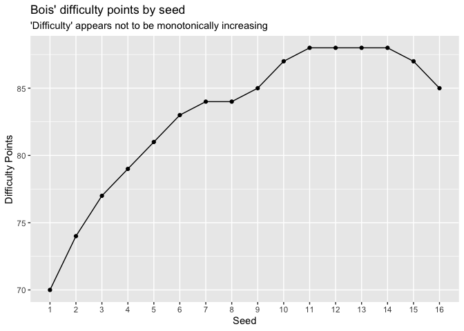<!-- -->

The trouble with Bois’ difficutly points is that they do not have
interpretable units. Facing an 8 seed gives 9 difficulty points whereas
facing a 14 seed gives 3 difficulty points, but there is no reason why
facing an 8 seed should be 3 times as difficult as facing a 14 seed.

Additionally, the additivity of difficulty points across rounds is not
well-justified. In fact, in less numerical settings, we tend to think of
the difficulty of a team’s tournament in terms of how soon a team will
have to face better opposition, as opposed to the sum-total of the
quality of all potential opposition en-route to the final.

However, Bois does point to some interesting trends in more tangible
statistics. Below is a visualization of win percentages by round and
seed. I omit rounds 5 and 6 due to small sample size. The irregularities
are striking. We would expect the win percentages in round 1 to decrease
with seed and for the win percentages to decrease with round for a given
seed. There are clear exceptions to both expectations.

``` r
round_levels %>% 
  map(seed_win_pcts) %>% 
  reduce(bind_rows) %>% 
  mutate(seed = seed %>% as_factor() %>% fct_inseq()) %>% 
  ggplot(aes(round, win_percent, color = seed)) +
  geom_hline(yintercept = 0, color = "white", size = 1.5) +
  geom_line(aes(group = seed)) +
  geom_point() +
  ggrepel::geom_text_repel(
    data = . %>% filter(round == "round_1"),
    mapping = aes(label = seed),
    nudge_x = -0.1
  ) +
  scale_x_discrete(labels = pretty_round_label) +
  scale_y_continuous(
    breaks = scales::breaks_width(0.2),
    labels = scales::label_percent()
  ) +
  guides(color = guide_none()) +
  labs(
    title = "Win percentage of each seed by round",
    subtitle = "Win percentage not statically decreasing in round or seed",
    x = "Round",
    y = "Win %"
  )
```

<!-- -->

To what extent these patterns are noise or real artifacts of the
tournament structure is difficult to say for the moment. For example,
the 8 seed’s poor win percentage in round 2 could be explained by the
fact that round 2 is the round where the 8 seed would hit the 1 seed.
However, the 10, 11, and 12 seeds seem to do better in round 2 than
round 1, even though their opponents are also significantly more
difficult in round 2.

A different (arguably more natural) way to understand how difficult the
tournament is for each seed is to look at each seed’s qualification rate
for different rounds; that is, the percent chance each seed makes it to
each round. Below are the qualification rates for the round of 32, the
round of 16 (the “Sweet Sixteen”), the quarterfinals (the “Elite
Eight”), and the semifinals (the “Final Four”).

``` r
round_levels[-1] %>% 
  map(qualify_pcts) %>% 
  reduce(bind_rows) %>% 
  mutate(seed = seed %>% as_factor() %>% fct_inseq()) %>% 
  ggplot(aes(round, prop, color = seed)) +
  geom_hline(yintercept = 0, color = "white", size = 1.5) +
  geom_line(aes(group = seed)) +
  geom_point() +
  ggrepel::geom_text_repel(
    aes(label = seed),
    data = . %>% filter(round == "round_2"),
    nudge_x = -0.1,
    size = 4
  ) +
  scale_x_discrete(labels = pretty_round_label) +
  scale_y_continuous(
    breaks = scales::breaks_width(0.2),
    labels = scales::label_percent()
  ) +
  theme(legend.position = "none") +
  labs(
    title = "Qualification rates for each round by seed",
    subtitle = "1, 2, and 3 seeds vastly outperform others",
    x = NULL,
    y = "Qualification %"
  )
```

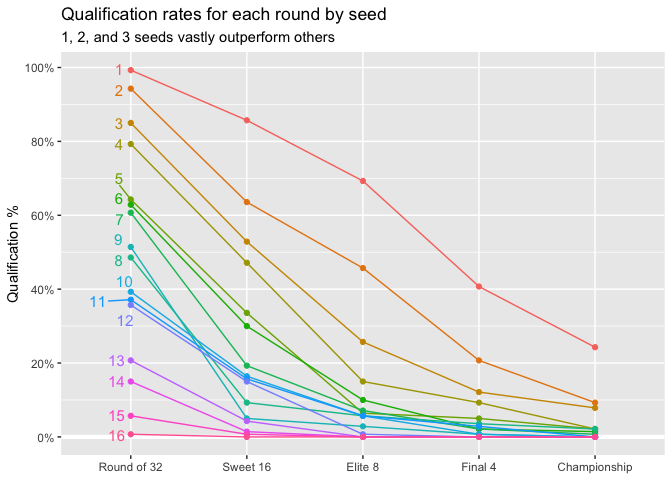<!-- -->

We see that the 10-12 seeds actually seem to qualify at higher rates
than the 8 and 9 seeds, despite qualifying for the round of 32 at lower
rates. No matter how you slice it, it appears that they have some kind
of advantage that the theoretically better 8 and 9 seeds don’t.

## Modeling win probabilities based on seeds

### A (very) simple model

To understand the difficulties each seed faces along the tournament, we
would like to have some model of win probability in the tournament.

The obvious thing to do would be to just use empirical win probabilities
of every seed matchup; that is, count the number of times a seed `x`
team beat a seed `y` team and divide by the total number of times a seed
`x` team played a seed `y` in the data to obtain the desired probability
estimate. Below is a visualization of these estimates.

``` r
ncaa_seed_combos %>% 
  bind_rows(
    ncaa_seed_combos %>% 
      transmute(
        seed_1 = .$seed_2,
        seed_2 = .$seed_1,
        seed_1_win_pct = 1 - .$seed_1_win_pct
      )
  ) %>% 
  right_join(expand_grid(seed_1 = 1:16, seed_2 = 1:16)) %>% 
  mutate(
    seed_1 = seed_1 %>% as_factor() %>% fct_inseq(),
    seed_2 = seed_2 %>% as_factor() %>% fct_inseq() %>% fct_rev()
  ) %>% 
  ggplot(aes(seed_1, seed_2, fill = seed_1_win_pct)) +
  geom_tile() +
  geom_text(
    aes(
      label = 
        seed_1_win_pct %>% 
        (scales::label_percent(accuracy = 1))
    ), 
    size = 2,
    color = "red2"
  ) +
  scale_x_discrete(position = "top") +
  scale_fill_viridis_c(
    breaks = scales::breaks_width(0.25),
    labels = scales::label_percent(accuracy = 1)
  ) +
  coord_equal(expand = FALSE) +
  guides(
    fill = 
      guide_colorbar(
        title.position = "top",
        title.hjust = 0.5,
        barwidth = unit(260, "pt"),
        barheight = unit(5, "pt")
      )
  ) +
  theme_minimal() +
  theme(legend.position = "bottom") +
  labs(
    title = "Win probabilities of seed matchups",
    subtitle = "Same-seed matchups ignored",
    x = "Team Seed",
    y = "Opponent Seed",
    fill = "Win %"
  )
```

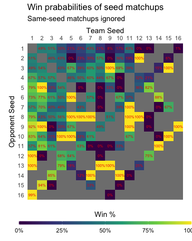<!-- -->

Some issues present themselves. For one thing, not all seed combination
have been realized, making estimation impossible. For another thing,
even where samples exist, there may not be very many, so this is a
**very** noisy statistic for some of the less common seed pairings. This
is untenable for our purposes, so I constructed a more sophisticated
model.

### A more sophisticated model

The model I will use (assuming `x < y`) is

`P(x,y | beta, lambda) = g(beta * sum(delta[x..(y - 1)]))`

where `g` is the inverse-logit function

`g(z) = (1 + exp(-z)) ^ -1`

and `delta` is a 15-vector satisfying

`sum(delta) == 1`

Informally, `delta[y]`should represent an incremental advantage that
seed `j - 1` has over seed `j`, so that the total advantage that seed
`i` has over seed `j` is given by `sum(delta[i..(j - 1)])`. Further,
`beta` should be read as an overall “effect size” as it were. Large
`beta` would mean that seed differences affect win probabilities a lot,
and small `beta` would mean that seed differences were less meaningful
in this way.

To fit this model, I consider it as a bayesian network. I assume the
following prior distributions

`beta ~ Exponential(2)`

`delta ~ Dirichlet(3, 2, 1,..., 1)`

and fit the data on all games played during or after the round of 64 in
every March Madness tournament since 1985.

I choose `beta` from an exponential prior because logically, we know
that `beta > 0`, else the model would imply worse seeds are more likely
to beat better seeds than not. Notice too that `beta` should be related
to the win probability of a `seed over a`6 seed. More specifically,
`g(beta)` is this probability. This guides our choice for the
exponential parameter; I choose 2 for no particular reason other than
that it implies a fairly plausible win probability for a 1 seed over a
16 seed (`g(2) ~~ 0.881`).

I choose parameters `(3, 2, 1,..., 1)` for the `delta` prior because we
expect to have a very wide talent gap between the 1 and the 2 seed and
the rest of the teams in the tournament. This is generally accepted as
true by most who analyze the tournament and is backed up by very high
win percentages by these seeds historically.

The model is then fit in Stan. The posterior distribution of the fitted
parameters is shown below.

``` r
params %>% 
  magrittr::extract2("delta") %>% 
  as_tibble() %>% 
  rename_all(str_replace, "^V", "delta_") %>% 
  pivot_longer(cols = everything()) %>% 
  mutate(name = factor(name) %>% fct_inorder() %>% fct_rev()) %>% 
  ggplot(aes(value, name)) +
  tidybayes::stat_halfeye(alpha = 0.5) +
  scale_y_discrete(
    labels = 
      function(s) {
        s %>% str_replace("_", "[") %>% str_c("]") %>% parse(text = .)
      }
  ) +
  labs(
    title = parse(text = "Marginal~posterior~distributions~of~delta[i]"),
    subtitle = "Samples generated from NUTS",
    x = expression(delta[i]),
    y = NULL
  )
```

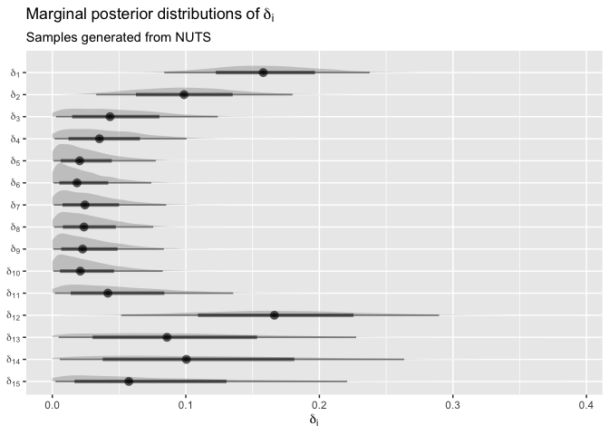<!-- -->

``` r
params %>% 
  as_tibble() %>% 
  ggplot(aes(x = beta)) +
  geom_hline(yintercept = 0, color = "white", size = 1.5) +
  geom_histogram(binwidth = 0.1) +
  scale_x_continuous(
    breaks = scales::breaks_width(0.5)
  ) +
  labs(
    title = parse(text = "Posterior~distribution~of~beta"),
    subtitle = "Samples generated from NUTS",
    x = expression(~beta),
    y = NULL
  )
```

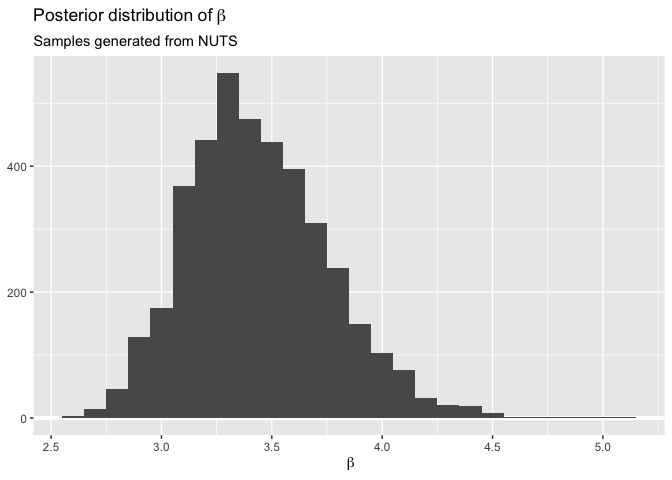<!-- -->

These distributions look reasonable, but they are next to impossible to
interpret. We would rather observe what the model believes about the
distribution of realized outcomes.

### Win probabilities

The fitted model now implies a distribution over game outcomes and
tournament outcomes. Below are the predicted win probabilities of each
seed matchup are according to our fitted model.

``` r
expand_grid(seed_1 = 1:16, seed_2 = 1:16) %>% 
  filter(seed_1 <= seed_2) %>% 
  mutate(
    seed_1_win_pct =
      map2(seed_1, seed_2, posterior_win_pct) %>% 
      map_dbl(mean)
  ) %>% 
  bind_rows(
    (.) %>% 
      transmute(
        seed_1 = .$seed_2,
        seed_2 = .$seed_1,
        seed_1_win_pct = 1 - .$seed_1_win_pct
      )
  ) %>% 
  right_join(expand_grid(seed_1 = 1:16, seed_2 = 1:16)) %>% 
  mutate(
    seed_1 = seed_1 %>% as_factor() %>% fct_inseq(),
    seed_2 = seed_2 %>% as_factor() %>% fct_inseq() %>% fct_rev()
  ) %>% 
  ggplot(aes(seed_1, seed_2, fill = seed_1_win_pct)) +
  geom_tile() +
  geom_text(
    aes(
      label = 
        seed_1_win_pct %>% 
        (scales::label_percent(accuracy = 1))
    ), 
    size = 2,
    color = "red2"
  ) +
  scale_x_discrete(position = "top") +
  scale_fill_viridis_c(
    breaks = scales::breaks_width(0.2),
    labels = scales::label_percent(accuracy = 1),
    limits = c(-0.01, 1.01)
  ) +
  coord_equal(expand = FALSE) +
  theme_minimal() +
  theme(legend.position = "none") +
  labs(
    title = "Mean of Posterior Winning %",
    x = "Team Seed",
    y = "Opponent Seed",
    fill = "Win %"
  )
```

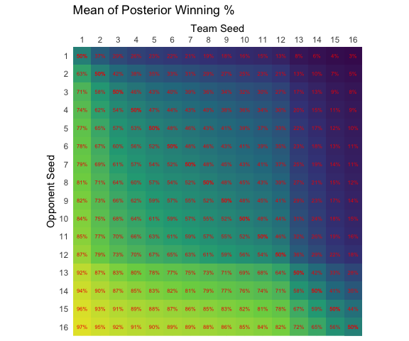<!-- -->

This model seems sensible. It is able to give what seem like reasonable
predictions for all seed matchups, even though we have next to no data
for some seed matchups.

### Round qualification rates

Of course, we are more interested in the bigger picture. Through monte
carlo simulation, we can sample from the distribution of all possible
tournaments. More specifically, we can sample a distribution of game
outcomes between an `x` seed and a `y` seed (with `x < y`) as follows
\[1\]:

  - Repeat as desired:
      - Repeat for all games in tournament:
          - Sample the parameters `beta` and `delta` from the posterior.
          - Compute `p = g(beta * sum(delta[x..(y - 1)]))`
          - Sample `q` from a uniform distribution over `(0, 1)`.
          - If `q < p`, declare `x` the winner, else declare `y` the
            winner.
  - Compute statistics on tournament sample

Below are the qualification rates for rounds until the Final Four in a
sample of 10,000 simulated 16-team tournaments generated via the above
method.\[2\]

``` r
qualify_pcts_from_tournaments <- function(results, round) {
  r <- round_num(round)
  
  results %>% 
    map(~ .[[str_glue(round)]]) %>% 
    unlist() %>% 
    tibble(seed = .) %>% 
    count(seed) %>% 
    right_join(
      tibble(seed = 1:16), 
      by = "seed"
    ) %>%
    replace_na(list(n = 0)) %>% 
    transmute(
      seed = seed,
      n = n,
      prop = 2 ^ (5 - r) * n / sum(n)
    )
}

compare_qualify_pcts <- function(round, tournament_sample) {
  tournament_sample %>% 
    qualify_pcts_from_tournaments(round) %>% 
    mutate(src = "model") %>% 
    bind_rows(
      qualify_pcts(round) %>% 
        mutate(src = "obs")
    )
}

plot_comparison_qualify_pcts <- function(round, tournament_sample) {
  round_label <- pretty_round_label(round)
  
  round %>% 
    compare_qualify_pcts(tournament_sample) %>% 
    ggplot(aes(x = seed, y = prop)) +
    geom_hline(yintercept = 0, color = "white", size = 1.5) +
    geom_line(aes(color = src)) +
    geom_point(aes(color = src)) +
    scale_x_continuous(
      breaks = scales::breaks_width(1),
      minor_breaks = NULL
    ) +
    scale_y_continuous(
      breaks = scales::breaks_width(0.1),
      labels = scales::label_percent(accuracy = 1)
    ) +
    scale_color_manual(
      breaks = c("model", "obs"),
      labels = c("model" = "Model Simulation", "obs" = "Empirical"),
      values = c("model" = "grey10", "obs" = "red2")
    ) +
    theme(legend.position = c(0.8, 0.8)) +
    labs(
      title = str_glue("Qualification rates for {round_label}"),
      subtitle = "Model mostly fits observed distribution",
      x = "Seed",
      y = str_glue("Qualification rate"),
      color = NULL
    )
}

round_levels[2:5] %>% 
  map(plot_comparison_qualify_pcts, tournament_sample) %>% 
  walk(print)
```

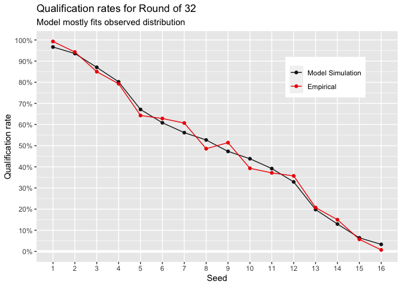<!-- -->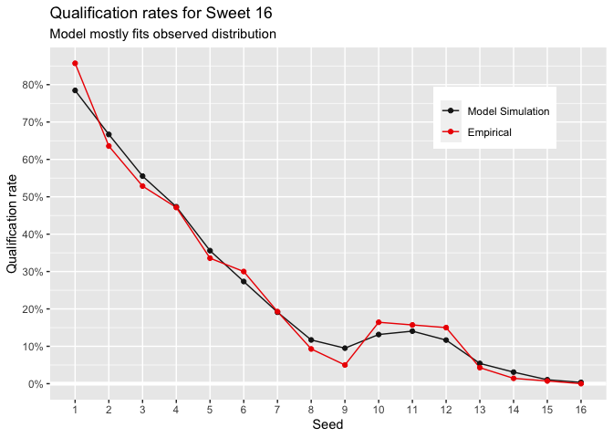<!-- -->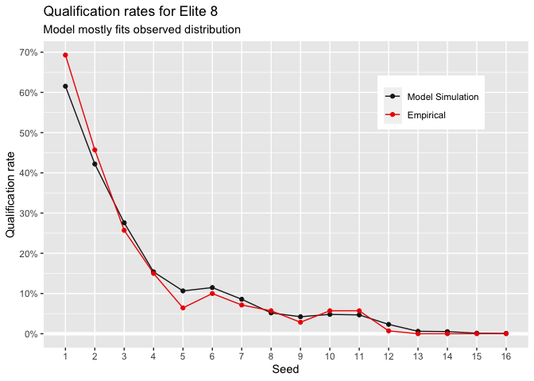<!-- -->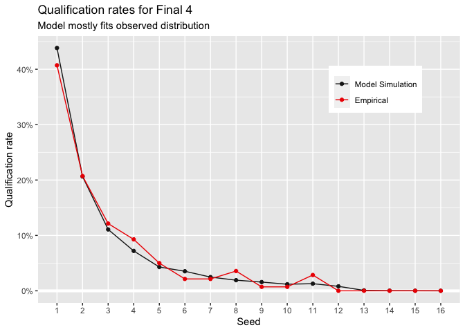<!-- -->

Interestingly, the fitted model seems to think it entirely possible for
the 10, 11, and 12 seeds to qualify at higher rates for the Sweet 16
than the 8 or 9 seeds, which corroborates Bois’ claim and my finding
that the 10-12 seeds have an easier path to the Sweet 16, and that this
advantage is entirely compatible with the assumption that the 10-12
seeds are underdogs to 8 and 9 seeds in head-to-head matchups in
general.

### Early-round upset sensitivity

It is informative to see how first-round upsets affect the tournament.
We can do this by simulating tournaments where we force a particular
game outcome in the first round. Below are the marginal effects of the
upsets of the top 4 seeds in the first
round.

``` r
plot_qualify_pcts_upsets <- function(round, upset_sample, baseline_sample) {
  upset_sample %>% 
    map(qualify_pcts_from_tournaments, round) %>% 
    map2(upsets, ~ mutate(.x, src = str_glue("{.y[1]}_{.y[2]}"))) %>% 
    reduce(bind_rows) %>% 
    bind_rows(
      baseline_sample %>% 
        qualify_pcts_from_tournaments(round) %>% 
        mutate(src = "model")
    ) %>% 
    ggplot(aes(seed, prop, color = src %>% as_factor() %>% fct_rev())) +
    geom_hline(yintercept = 0, color = "white", size = 1.5) +
    geom_line() +
    geom_point() +
    scale_x_continuous(
      breaks = scales::breaks_width(1), 
      minor_breaks = NULL
    ) +
    scale_y_continuous(
      breaks = scales::breaks_width(0.1),
      labels = scales::label_percent()
    ) +
    scale_color_brewer(
      labels = function(b) {
        if_else(
          b == "model",
          "Baseline",
          b %>% 
            str_split("_") %>% 
            map_chr(str_c, collapse = " over ")
        )
      },
      type = "qual",
      palette = "Set1"
    ) +
    theme(legend.position = c(0.85, 0.75))
}

round_levels[3:5] %>% 
  map(plot_qualify_pcts_upsets, upsets_tournament_sample, tournament_sample) %>% 
  map2(
    round_levels[3:5],
    ~ (.x) +
      labs(
        title = 
          str_glue(
            "Qualification rates for {pretty_round_label(.y)} after upsets"
          ),
        subtitle = "Intermediate seeds see greatest benefit in later rounds",
        x = "Seed",
        y = "Qualification %",
        color = NULL
      )
  ) %>% 
  walk(print)
```

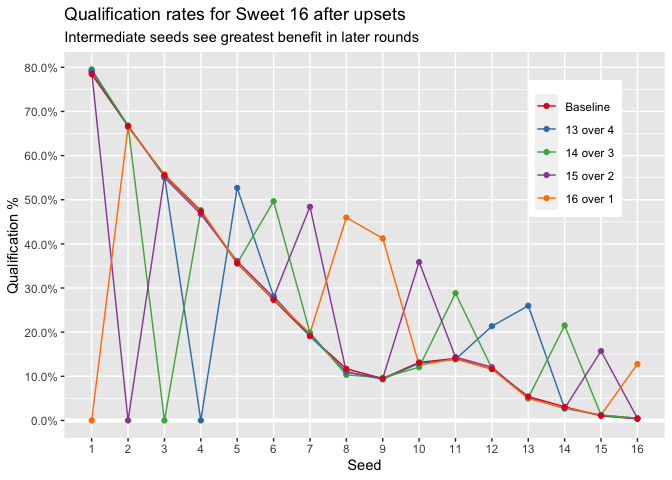<!-- -->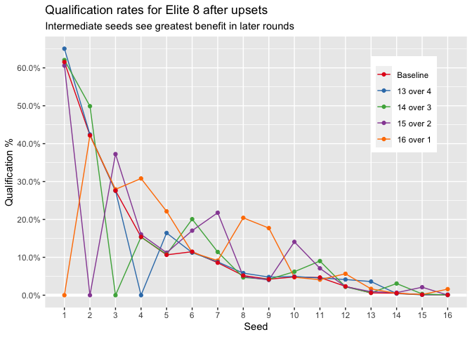<!-- -->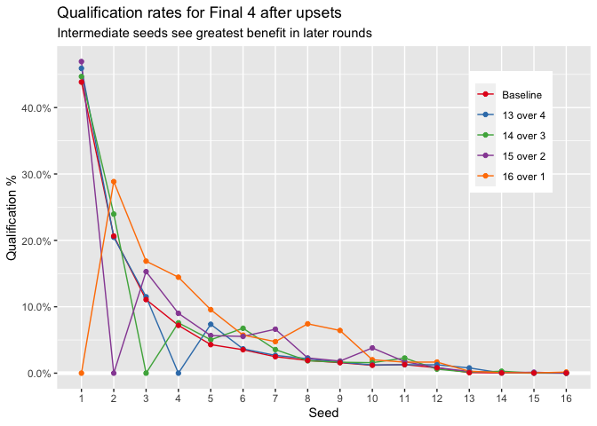<!-- -->

Somewhat obviously, the model believes major upsets in the first round
benefit the favorite’s would-be second-round match-ups. The effect also
propagates to their later round match-ups, but the strength of that
effect dimishes as rounds go on.

This doesn’t seem all that surprising, but the fact that even one of
these early round upsets can cause the qualification rates to jump
noticeably shows how sensitive the tournament is to these. Additionally,
even though any particular upset is unlikely, it is more likely than not
that at least one occurs in the first round of the tournament. For
example, consider the four upsets we visualized above. According to the
model:

  - 16 upsets 1 with a 3% chance
  - 15 upsets 2 with a 4% chance
  - 14 upsets 3 with a 6% chance
  - 13 upsets 4 with an 8% chance

This implies that the chance that at least one of these upsets happens
in a 64-team tournament (such as March Madness) comes out to about

`(0.97 * 0.96 * 0.94 * 0.92) ^ 4 ~~ 58%`

The shapes of the Sweet 16 qualification rate plots suggest that the
10-12 seeds are often able to take advantage of these upsets. The 8 and
9 seeds do not see such a big benefit, likely because the 1 and 2 seeds
are upset too infrequently to allow the 8 and 9 to avoid them in round
2. It seems the 10-12 seeds lie in a kind of “sweet spot” where they are
good enough to beat their 5-7 seed opponents often enough to make it to
round 2 pretty frequently while also seeing the right upset occur often
enough that they benefit and have an easier time making it to the Sweet
16 in a substantial number of cases. These seeds are rewarded because
they can’t hit the 1 or 2 seeds until later in the tournament.

Taken together, the model seems to believe that the difficulty of the
later rounds of the tournament isn’t smoothly decreasing along seeds. In
particular, there is a bizarre structural advantage for 10-12 seeds in
being “further” from the 1 and 2 seeds than the 8 and 9 seeds.

## Reseeding

Our simulation methods allow us to test a different tournament design
with the same win probability model. In this way, we can draw
conclusions about how the dynamics of the tournament might change under
new rules.

In this case, a reseeded tournament seems like an intriguing alternative
to consider. In a reseeded tournament, instead of obeying a strict
bracket structure from round to round, the best seed remaining in each
regional bracket would be matched up with the worst seed remaining, the
second best seed matched with the second worst, etc.

I drew a sample of 10,000 reseeded 16-team tournaments via simulation
with the same win probability model as before and I compared
qualification rates with the original sample of simulated 16-team
tournaments.

``` r
compare_reseeded_qualify_pcts <- function(round) {
  round_label <- pretty_round_label(round)
  
  reseeded_tournament_sample %>% 
    qualify_pcts_from_tournaments(round) %>% 
    mutate(src = "reseeded") %>% 
    bind_rows(
      tournament_sample %>% 
        qualify_pcts_from_tournaments(round) %>% 
        mutate(src = "squo")
    ) %>% 
    ggplot(aes(seed, prop, color = src)) +
    geom_hline(yintercept = 0, color = "white", size = 1.5) +
    geom_line() +
    geom_point() +
    scale_x_continuous(
        breaks = scales::breaks_width(1),
        minor_breaks = NULL
      ) +
      scale_y_continuous(
        breaks = scales::breaks_width(0.1),
        labels = scales::label_percent(accuracy = 1)
      ) +
      scale_color_manual(
        breaks = c("squo", "reseeded"),
        labels = c("squo" = "No Change", "reseeded" = "Reseeding"),
        values = c("squo" = "grey10", "reseeded" = "red2")
      ) +
      theme(legend.position = c(0.8, 0.8)) +
      labs(
        title = 
          str_glue("Qualification rates in {round_label} after reseeding"),
        subtitle = "Differences from non-reseeded rates are small",
        x = "Seed",
        y = str_glue("% of {round_label} rounds qualified for"),
        color = NULL
      )
}

round_levels[3:5] %>% 
  map(compare_reseeded_qualify_pcts) %>% 
  walk(print)
```

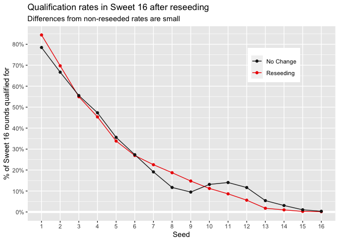<!-- -->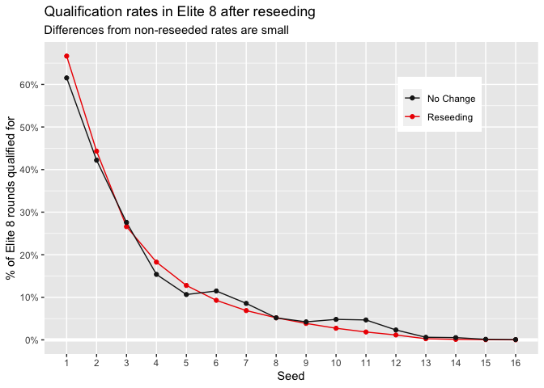<!-- -->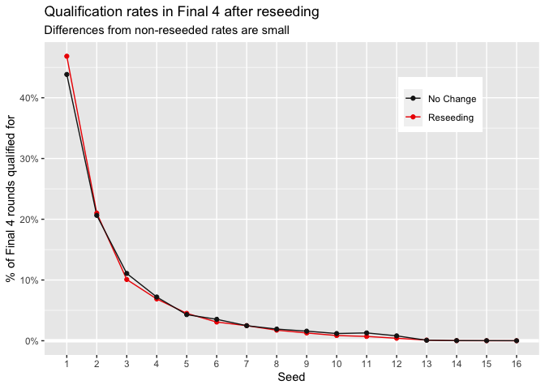<!-- -->

It is immediately clear that reseeding eliminates the strange advantage
for lower seeds when qualifying for the Sweet 16 at the expense of the 8
and 9. It is also clearer that a similar (though much smaller) quirk was
present in the Elite 8 qualifications, where 6, 7, 10, and 11 seeds are
rewarded for avoiding the 1 seed until the Final Four. By the Final
Four, the 1 and 2 seeds clean house. The 1 seed, as expected, has an
easier path to the Final Four, always having the easiest opponent of all
remaining teams in each round.

The marginal effects of a big first-round upset are also more uniform
when reseeding. Below is a visualization of the qualification rates
conditioned on major upsets in a reseeded tournament.

``` r
round_levels[3:5] %>% 
  map(
    plot_qualify_pcts_upsets, 
    upsets_reseeded_tournament_sample, 
    reseeded_tournament_sample
  )  %>% 
  map2(
    round_levels[3:5],
    ~ (.x) +
      labs(
        title = 
          str_glue("Qualification rates for {pretty_round_label(.y)} after upsets when reseeding"),
        subtitle = "Remaining top seeds benefit most from an early upset",
        x = "Seed",
        y = "Qualification rate",
        color = NULL
      )
  ) %>% 
  walk(print)
```

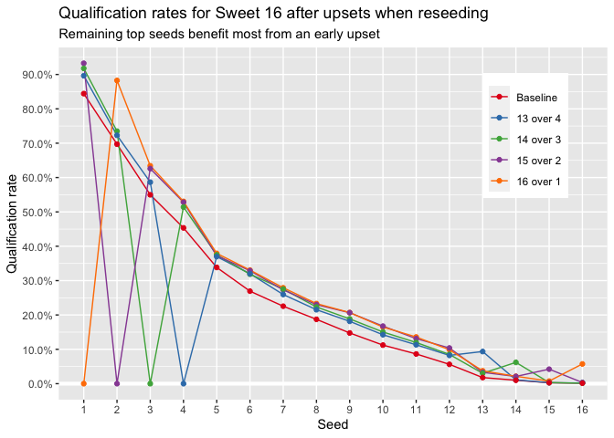<!-- --><!-- -->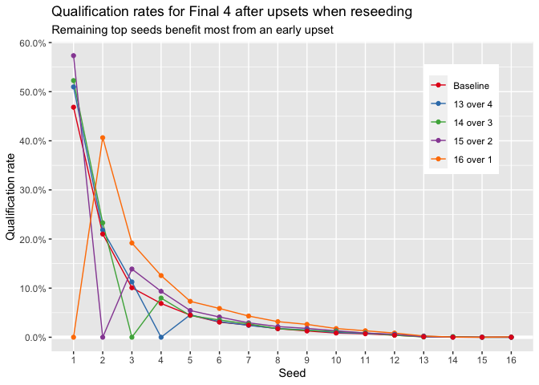<!-- -->

Tournament purists might see these results and believe that the March
Madness tournament is flawed for allowing lower seeds such unusal
advantages that are easily avoided by reseeding the rounds. But I, and I
imagine many viewers, don’t mind seeing the chaos of the current
tournament unfold every year. Fans always love a good cinderella story,
and from what we’ve uncovered here, it appears that the tournament
allows deep tournament runs by underdogs slightly more likely in a way
that does not completely ruin viewer’s sensibilities of who the best
teams are.

## Acknowledgements

The data for this project was published by Michael Roy on
[data.world](https://en.wikipedia.org/wiki/NCAA_Division_I_Men%27s_Basketball_Tournament#Current_tournament_format).

1.  Of course, for this tournament format, it would be possible to
    compute the distributions of interest analytically. But simulation
    becomes much easier when we evaluate other tournament formats (in
    our case, the reseeded tournament) which may require computing the
    probabilities of many different combinations of outcomes. I also
    wanted to learn more about simulation through this project, so I
    didn’t really care if there was an easier way to do this anyways.

2.  We only simulate until the Final Four, so we only need to consider
    the 16 seeded teams in one region of the tournament in isolation.
